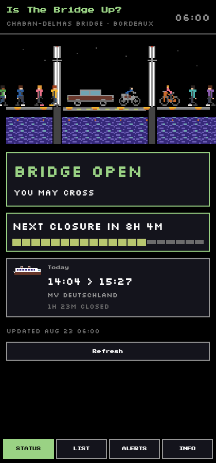

# IsTheBridgeUp


Know whether you can cross the **Pont Chaban-Delmas** in Bordeaux — before you
end up stuck on the wrong bank of the Garonne for an hour.

The bridge is a vertical-lift bridge: its central span rises to let tall ships
up the river, and while it is up the road is shut. Bordeaux Métropole publishes
the forecast closures as open data. This app turns that into one answer.

Built with Flutter so a single codebase covers web, Android and iOS.
**This pass ships the web app**; the mobile targets are wired for but not yet
enabled (see [Roadmap](#roadmap)).



## What it does

- **Status** — a plain OPEN / CLOSED verdict, a live countdown, and a pixel-art
  scene of the bridge that raises its span and lets a ship through.
- **List** — every upcoming closure, with vessel names and durations.
- **Alerts** — device reminders before a closure, on Android and iOS. Asking
  for permission happens when you turn alerts on, not on first launch. On web
  the screen explains why it cannot work there.
- **Info** — attribution, licence, and the caveat that these are *forecasts*.

Fully localised in **French and English**, following the device locale.

## The data

Bordeaux Métropole's OpenDataSoft Explore v2.1 API:

```
https://datahub.bordeaux-metropole.fr/api/explore/v2.1/catalog/datasets/previsions_pont_chaban/records
```

Fronted on data.gouv.fr as
[pont-chaban-previsions-fermeture-1](https://www.data.gouv.fr/datasets/pont-chaban-previsions-fermeture-1),
under the *Licence Ouverte / Open Licence*. It sends
`access-control-allow-origin: *`, so the web build calls it directly with no
proxy. Anonymous rate limit is 50,000 requests/day.

Six fields, all text except `date_passage`:
`bateau`, `date_passage`, `fermeture_a_la_circulation`,
`re_ouverture_a_la_circulation`, `type_de_fermeture`, `fermeture_totale`.

There is **no real-time feed** — nothing reports whether the span is up right
now. Status is derived from the forecast, and the app says so rather than
implying certainty.

### Four things this feed will get you wrong

All four are handled in [`bridge_clock.dart`](lib/src/domain/bridge_clock.dart)
and pinned by tests. They are written down here because each one silently
produces a *plausible* wrong answer, which is the worst kind for an app whose
whole job is telling you not to drive to the bridge.

1. **`where=date_passage >= now()` drops today's closures.** `date_passage` is a
   date at midnight, so today's midnight is already in the past. Run on
   2026-08-23, that query returned 36 rows and omitted *both* of that day's
   closures. Query from **yesterday** and filter client-side instead.
2. **Rows are not time-ordered within a day.** The live feed returned `14:04`
   before `04:19` for the same date. Sort on the computed start instant.
3. **Closures can span midnight.** Six rows reopen *before* they close
   (`23:00 → 05:00`). Read as same-day, they produce a negative duration.
4. **Times are Europe/Paris with no zone attached, and DST is real.** An
   overnight closure is 5 real hours across the spring-forward night and 7
   across the fall-back one, not 6. Build the end from calendar fields in the
   bridge's own zone — `start.add(Duration(days: 1))` is an hour wrong twice a
   year.

## Architecture

Flutter's recommended MVVM, with `provider` for wiring. No code generation.

```
lib/
  main.dart                     entry point: tz init, DI, runApp
  l10n/                         ARB sources + generated AppLocalizations
  src/
    app.dart                    MaterialApp, theme, tab shell
    core/                       config, Result, typed errors
    domain/                     PURE: Closure, BridgeStatus, BridgeClock,
                                ReminderPlanner — no HTTP, no widgets, no
                                ambient clock, so the hard parts are cheap
                                to test
    data/
      services/                 API, offline cache, notification interface
      repositories/             ClosureRepository: cache-first source of truth
    ui/
      theme/                    C64 palette, text styles, generated sprites
      widgets/                  PixelSprite, panels, buttons, bridge scene
      status/ schedule/ alerts/ info/    view + view-model per screen
tools/gen_sprites.py            draws the sprites, emits pixel_sprites.dart
```

`BridgeClock` takes an injectable `now`, so every time-dependent behaviour is
testable without waiting for a clock.

## Design

8-bit pixel art. The bridge, water and UI chrome are on the real **Commodore 64
(Pepto) palette** — sticking to one hardware palette is what stops it looking
merely retro-ish.

The **people bring their own colours**, sampled from a reference character
sheet. That is a deliberate break: the C64 palette has no usable pink, teal or
skin tone, and with everything in greys the pedestrians read as identical
mannequins rather than people. At 15 px, colour *is* the thing that tells one
person from another.

Sprites are **not image files**. They are character matrices generated by
[`tools/gen_sprites.py`](tools/gen_sprites.py) into
[`pixel_sprites.dart`](lib/src/ui/theme/pixel_sprites.dart), then painted as
run-length rectangles at whole-number scale. So they are diffable, tweakable in
code, crisp at any DPI, and need no binary assets.

Traffic crossing the open bridge is a car, a motorbike with a rider, a cyclist,
and a cast of **six distinct people** — each with their own hair, skin tone,
top, trousers and shoes, at their own walking speed.

The reference sheet's sprites are ~106 px tall; the scene renders people at
15 px. Downsampling turns a 106 px figure into 5 px of mush, so the cast is
hand-drawn at scene scale using the reference's *palette and identities*
rather than its pixels. (At 24 px a downsample does start to read — but that
would mean a 58 px car in a 150 px scene, breaking the scale coherence below.)

Everything shares **one scale: 8.5 px per metre**. That was not true at first —
the implied scale ran from 4.8 px/m (the car, lengthwise) to 22 px/m (a
pedestrian), which is why the vehicles looked like they came from different
sets:

| sprite | real size | pixels |
|---|---|---|
| pedestrian | 0.5 x 1.75 m | 11 x 15 |
| cyclist | 1.75 x 1.9 m | 17 x 16 |
| motorbike | 2.1 x 1.8 m | 18 x 15 |
| car | 4.2 x 1.5 m | 36 x 13 |

The ship is deliberately outside that scale — a real cruise ship would be
1,700 px long — but it is still drawn far larger than a car so the relationship
reads correctly.

Figures are generated **from a skeleton**, not hand-placed per frame: joints
swing and limbs are drawn between them. That is what keeps proportions
identical across a cycle and makes the motion read as weight rather than a
slide. Walkers have a four-frame cycle, cyclists and motos two. Every frame is
chosen from **distance travelled rather than a timer**, so a stride stays in
step with the walking speed and a crank with the pedalling speed. Re-run after
editing:

```bash
python3 tools/gen_sprites.py     # rewrites pixel_sprites.dart + a preview PNG
python3 tools/gen_icons.py       # rewrites the favicon and PWA icons
```

App icons are a separate design, generated by
[`tools/gen_icons.py`](tools/gen_icons.py) from a **24x24** grid — chosen
because 24 divides every Android launcher density exactly (48=x2, 72=x3,
96=x4, 144=x6, 192=x8), so each source pixel stays a perfect square. A 32-grid
needed fractional scaling at 48 and 144, which makes pixel art look like a
mistake rather than a style.

Its palette is **sampled from the reference logo** rather than invented:
daylight azure sky `#4591EA`, warm stone towers `#DCD9C6`, red aviation bands,
Garonne blue below. That deliberately differs from the app's night-time C64
interior — the icon is a daylight portrait of the bridge, the app is a dark
instrument panel.

The composition earns its keep at 48px by showing one thing: the span raised
with **clear sky in the gap beneath it**. That gap is the whole message — a
ship can get through and you cannot.

Android gets proper **adaptive icons** (`mipmap-anydpi-v26`), not just a legacy
PNG: modern launchers shrink and letterbox legacy icons. The foreground is
rendered with a transparent sky so the background colour layer shows through,
and the art is kept inside the guaranteed-visible inner 72dp of the 108dp
canvas.

Unlike the sprites, the icons are not staleness-checked in CI: they are PNGs,
and zlib output can differ between Python versions.

Type is `Press Start 2P` (chrome, labels, tabs) and `Silkscreen` (content and
the verdict), both OFL and bundled.

> Press Start 2P squeezes **accented capitals** into the unaccented letter's
> box, so `É` comes out stunted. Use it only for strings without one; French
> copy that gets upper-cased belongs in Silkscreen, which puts the accent above
> cap height. Lowercase accents are fine in either — which is why the French
> title reads correctly but "DÉSACTIVÉES" did not.

> Pixel fonts have sparse coverage, and Google Fonts' declared `unicode-range`
> is **not** proof a glyph exists. `→` is genuinely absent from Silkscreen and
> rendered as tofu in both languages; Press Start 2P crams `É` into the same
> box as `E`, so "PONT FERMÉ" looked like a typo. Both are fixed, and
> [`font_coverage_test.dart`](test/font_coverage_test.dart) parses the actual
> TTF `cmap` tables to make sure no UI string ever uses a glyph the fonts lack.

## Running it

Needs Flutter 3.47.1 (`brew install --cask flutter`).

```bash
flutter pub get
flutter run -d chrome                              # develop
flutter test                                       # everything
flutter test --exclude-tags "live,golden"           # what CI runs
flutter build web --base-href /IsTheBridgeUp/       # production build
```

### Tests

| Suite | Covers |
|---|---|
| `bridge_clock_test.dart` | the four traps above, DST, malformed rows |
| `chaban_api_service_test.dart` | query shape, both payload shapes, errors |
| `closure_repository_test.dart` | cache-first, offline, corrupt cache, staleness |
| `reminder_planner_test.dart` | which reminders get scheduled, and when |
| `font_coverage_test.dart` | every UI character has a real glyph |
| `layout_test.dart` | no overflow, 320→1200pt, both locales, every tab |
| `golden/` | pixel-exact screenshots (tag `golden`) |
| `live_api_test.dart` | canary: the real endpoint and schema (tag `live`) |

The `live` canary exists because the previous version of this app died silently
when the old OpenDataSoft v1 endpoint was retired. It runs as its own
non-blocking CI job so an upstream outage never fails a merge, but still says so
loudly.

## Alerts

Reminders are scheduled on the device by `flutter_local_notifications`.

Lead times are **multi-select** — 30m, 1h, 2h, 4h and 1 day — so one closure
can warn you the day before *and* again on the hour. Deselecting the last one
is ignored: alerts that are on with no timing would schedule nothing while
claiming to be active.

A day-ahead reminder names the day, because "closes at 14:04" is ambiguous when
you read it the evening before. The reminder list does the same, showing the
closure's date only when it differs from the day the reminder fires.

Several leads multiply the reminder count, and iOS caps pending notifications
at 64 per app. The planner sorts by fire time and truncates at 48, so when the
selection overflows it is the *soonest* reminders that survive — and the screen
says so rather than silently dropping them.

Two more decisions worth knowing:

**Permission is requested from the Alerts screen**, when the user turns alerts
on — never on launch. A prompt that appears before the app has explained itself
gets refused, and on Android a refusal is effectively permanent.

**Alarms are inexact on purpose.** Exact delivery needs `SCHEDULE_EXACT_ALARM`,
which Android 14+ gates behind a trip to system settings and which Play Store
review scrutinises. A warning an hour ahead does not need to-the-second
timing, so the app asks for a battery-friendly alarm instead and says so on
screen. Neither `SCHEDULE_EXACT_ALARM` nor `USE_EXACT_ALARM` is declared.

The plugin *builds* for web — it has a web implementation and no `dart:io` —
but `zonedSchedule` throws there, because a browser cannot run code once its
tab is closed. `NotificationService.canSchedule` reflects that, and the screen
explains it rather than showing a dead switch.

## Roadmap

- **Android and iOS.** The code is platform-agnostic; enable the targets
  (`flutter create --platforms android,ios .`) and install the toolchains.
- **Which bank am I on** — geolocation, picking up the idea from the abandoned
  `whereAmI` branch.
- **Calendar export** (`.ics`).

## History

This began as an Angular 16 learning project that rendered a raw HTML table.
It stopped working when its data source, the OpenDataSoft **v1** API, was
retired. That version is preserved in git history (`e03cbd7`, `fb6e16d`) and on
the `gh-pages` branch.

## Licence

GPL-3.0 — see [LICENSE](LICENSE). Bridge data © Bordeaux Métropole under the
Licence Ouverte. Fonts under the SIL Open Font License (see `assets/fonts/`).
